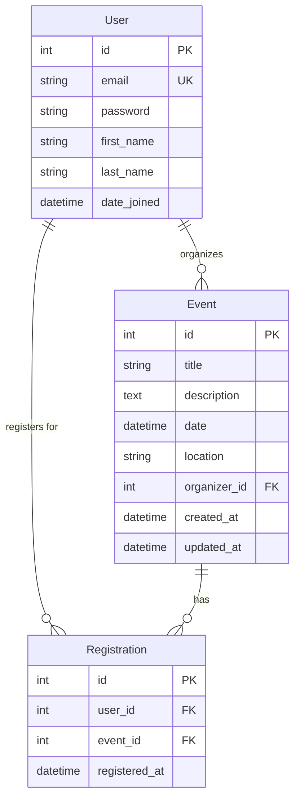

# Data Model

## Entity Relationship Diagram

## Models & Constraints

### User
Custom user model using `email` as the unique identifier (`USERNAME_FIELD`).
- **Indexes**: `email` (unique, b-tree).

### Event
Represents a conference, meetup, or other gathering.
- `organizer`: ForeignKey to `User`, `on_delete=CASCADE`.
- **Indexes**:
  - `date` (for sorting and filtering).
  - `location` (for filtering).
  - `organizer` (for filtering).
  - Standard b-tree indexes for basic lookups.

### Registration
Mapping table linking Users to Events they are participating in.
- `user`: ForeignKey to `User`, `on_delete=CASCADE`.
- `event`: ForeignKey to `Event`, `on_delete=CASCADE`.
- **Constraints**: 
  - `UniqueConstraint` on `(user, event)` to prevent double registration.
